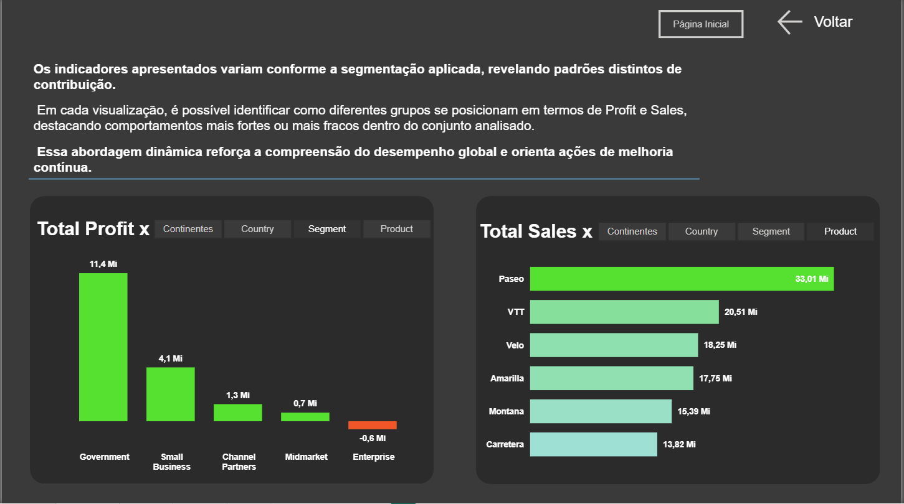

# Projeto: Storytelling e Análise Dinâmica com Parâmetros de Campos

Este projeto representa a etapa final da evolução do Relatório Financeiro (Global Sales), focando em técnicas avançadas de interatividade e narrativa de dados (**Data Storytelling**).

O objetivo principal foi criar uma visão executiva flexível, onde o usuário final tem o poder de escolher *como* quer visualizar os dados, sem a necessidade de navegar por múltiplas páginas ou criar dezenas de gráficos separados.

## 🚀 Funcionalidade Principal: Parâmetros de Campos

A grande inovação desta página é a implementação de **Field Parameters (Parâmetros de Campos)**. Isso permite alterar dinamicamente o eixo das visualizações com um simples clique.

### O Que Foi Implementado:

1.  **Seleção Dinâmica de Dimensão:**
    * Foram criados botões de segmentação integrados aos gráficos: **Continentes**, **Country**, **Segment** e **Product**.
    * Ao clicar em "Product", por exemplo, ambos os gráficos se reajustam automaticamente para mostrar o desempenho por produto. Ao clicar em "Country", mudam para a visão geográfica.

2.  **Visualizações Adaptáveis:**
    * **Total Profit (Esquerda):** Gráfico de colunas que analisa a lucratividade.
        * *Destaque:* Utilização de formatação condicional (Verde para lucro, Vermelho para prejuízo), visível no segmento "Enterprise".
    * **Total Sales (Direita):** Gráfico de barras focado no volume de vendas, facilitando a comparação de magnitude entre as categorias selecionadas.

## 📖 Storytelling e Contexto

Seguindo as boas práticas de design de relatórios, a página não apresenta apenas números soltos.

* **Narrativa Guiada:** Foi incluída uma seção de texto no topo ("Os indicadores apresentados variam...") que atua como um guia para o usuário. Ela explica o propósito da análise e instrui sobre como a segmentação revela padrões distintos de comportamento.
* **Design Consistente:** A página mantém a identidade visual "Dark Mode" estabelecida no projeto anterior, com fundo cinza chumbo e containers com bordas arredondadas, garantindo uma experiência de usuário (UX) fluida e profissional.

## 🛠️ Benefícios Dessa Abordagem

* **Redução de Poluição Visual:** Em vez de criar 4 gráficos diferentes para cada métrica (um por país, um por produto, etc.), utilizamos apenas 2 gráficos que fazem o trabalho de 8.
* **Empoderamento do Usuário:** O analista ou gestor pode investigar a causa raiz de um problema alternando as visões rapidamente (ex: "O lucro está baixo. É um problema de *País* ou de *Produto*?").

## 💻 Tecnologias Utilizadas

* **Power BI Desktop**
* **Recurso:** Modelagem > Novos Parâmetros > Parâmetros de Campos.
* **UX/UI:** Containers, Sombramento e Texto Dinâmico.
